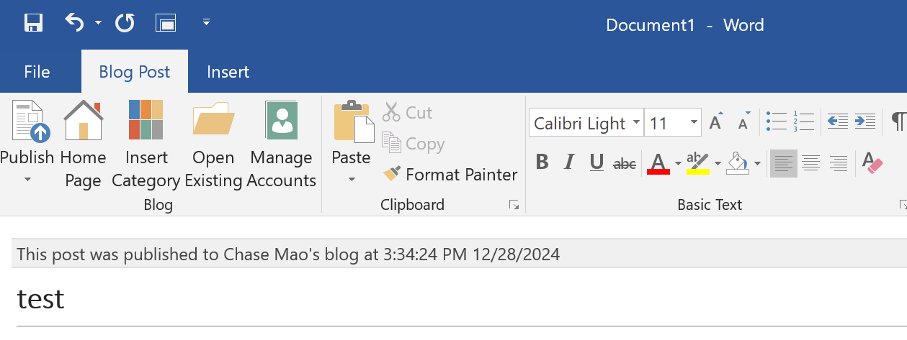

# metaweblog-go

metaweblog server developed by go, fully tested with Office Word 2016, support publish blog with image.



## Usage

1. New a config file `config.yaml`, for example

```yaml
blogURL: https://chasemao.com
blogTitle: Chase Mao's blog
hugoRootDir: ../hugoblog/
contentDir: ../hugoblog/content/article/
userName: xxx
password: yyy
```

2. Run metaweblog go server on localhost:1314

```bash
metawebloggo
```

3. Optional flag `-a`, choose the address where the server is listening.